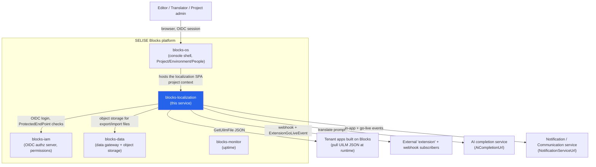
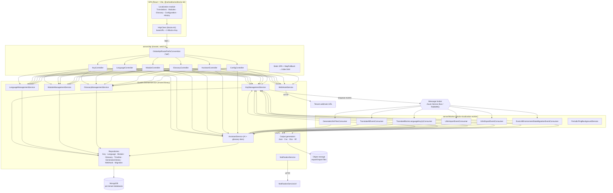
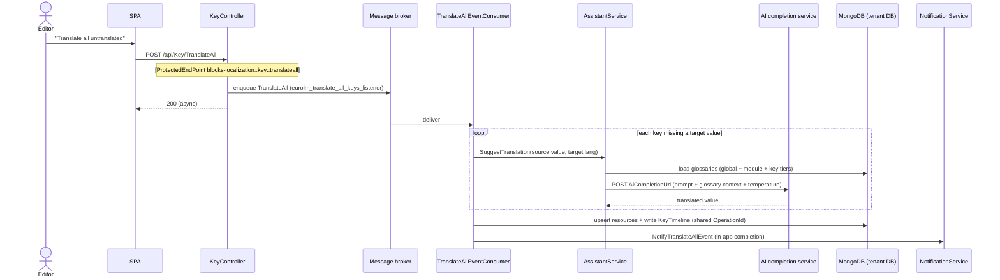
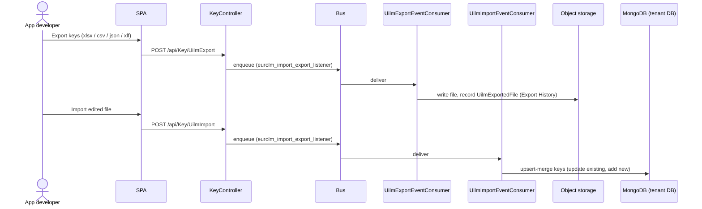

# Blocks Localization (`blocks-localization`) — Architecture Specification

> **Naming — Open / undecided.** The authoritative decisions file
> (`DECISIONS-blocks-localization.md`) was empty at the time of writing: it
> contains only a header and no captured decisions. The product name is
> therefore **not yet decided**. The repository ships under three competing
> names, all referring to this one service:
>
> - **Blocks Localization** — the SPA browser-tab title and the service
>   identifier `blocks-localization` (`Constants.ServiceName`, permission
>   prefix, CI `SERVICE_NAME`, secret key `blocks-secret-localization`).
> - **EuroLM / Eurolm** — the internal/legacy name: server namespaces
>   (`Eurolm.DomainService`, `Eurolm.Driver`), message queues (`eurolm_*`),
>   DI extension `AddEurolmRegisterApplicationServices`, README title
>   "Blocks EuroLM".
> - **UILM** — used for the produced artifacts ("UILM file", `UilmFile`,
>   client API-base alias `UILM`, endpoints `GetUilmFile` / `UilmImport` /
>   `UilmExport`). Not expanded anywhere in code.
>
> This document uses the repository id **`blocks-localization`** as the neutral
> reference and treats "Blocks Localization" as the working customer-facing
> name, but this is provisional until the naming decision is made.

> **Grounding note.** With the decisions file empty, this spec describes the
> **as-is** architecture of the code, cross-checked against the earlier product
> brief (`Guides/product-details-v1-blocks-localization.md`). Where a design is
> genuinely unresolved it is marked **Open / undecided**; the still-open product
> questions (naming, auto-publish vs. deliberate publish, translator role,
> import-format parity, the external "extension") are carried through as
> Open Questions in the relevant sections rather than answered by invention.

---

## 1. System Context

`blocks-localization` is the **translation-management service** of the SELISE
Blocks platform. It is a per-**Project** service that lives inside the Blocks
console: a team collects every user-facing UI string of the apps they build on
Blocks, stores each string as a named **Key**, translates it into any number of
**Languages**, and delivers the results to running apps as compiled JSON
dictionaries (**UILM files**). Translations are produced by hand, by an AI
assistant (steered by a **Glossary**), or via offline round-trip files
(xlsx / csv / json / xlf). Every operation is scoped to the current Project via
the tenant key.

Like every Blocks service it is **.NET 10 (server) + React/Vite (client)**,
**multi-tenant via an `X-Blocks-Key` tenant key**, and **authenticates through
blocks-iam via OIDC**. It runs as three cooperating processes: the **Api**
(Kestrel, also serves the SPA), a background **Worker**
(`blocks-localization-worker`, message consumers), and the **SPA** served from
`server/Api/wwwroot`.



**Boundary notes (grounded):**

- **blocks-os** provides the console shell, the Project/Environment context,
  and shared UI (`@seliseblocks/blocks-kit`); the localization SPA renders
  inside it. `TenantId` (the Project key) flows in as `X-Blocks-Key`.
- **blocks-iam** is a hard dependency for both authentication (OIDC) and
  authorization (per-endpoint permissions). See §5.
- **blocks-data** is used **only** as an object-storage backend for
  export/import artifacts (`RegisterBlocksStorageServices`,
  `AwsS3CompatibleStorageService`, DMS artifact builders). Localization does
  **not** route its domain data through the GraphQL data gateway — it owns its
  own MongoDB collections (see §4 and §9).
- **blocks-monitor** is not a runtime dependency. The service keeps its own
  business-level change history (Timeline), which is distinct from platform
  infrastructure monitoring.

---

## 2. Component Architecture

Three deployables share one domain library (`Eurolm.DomainService`), wired by
`ServiceRegistry.AddEurolmRegisterApplicationServices`. Singleton services and
repositories are registered once and reused by both the Api and the Worker.



**Key components (grounded in code):**

| Component | Responsibility | Location |
|---|---|---|
| `KeyController` | CRUD keys, bulk save/delete, translate (single/bulk/all), publish (`GenerateUilmFile`), import/export, timeline, rollback, generation history, runtime `GetUilmFile` | `server/Api/Controllers/KeyController.cs` |
| `LanguageController` | Add/list/delete languages, set default (source) language | `LanguageController.cs` |
| `ModuleController` | Save/list modules, tag glossaries to a module | `ModuleController.cs` |
| `GlossaryController` | CRUD glossaries + "suggested glossaries" matcher | `GlossaryController.cs` |
| `AssistantController` | On-demand translation suggestion | `AssistantController.cs` |
| `ConfigController` | Read/save the outbound webhook config | `ConfigConroller.cs` |
| `KeyManagementService` | Core orchestration: persistence, event enqueue, UILM generation (`GenerateAsync` / `ProcessUilmFile`), timeline writes, export/import | `Eurolm.DomainService/Services/Key/KeyManagementService.cs` |
| `AssistantService` | Builds the AI prompt with 3-tier glossary context, calls `AiCompletionUrl` (ChatGPT-style), Polly circuit breaker | `Services/Assistant/AssistantService.cs` |
| Output generators | Serialize keys to Json/Csv/Xlsx/Xlf for export | `Services/Key/*OutputGeneratorService.cs` |
| Worker consumers | Async execution of translate/generate/import/export/migration | `server/Worker/Consumers/*` |

---

## 3. Key Runtime Flows

### 3.1 Publish (generate & deliver runtime UILM files)

The "Publish Changes" action compiles a JSON dictionary per Module per Language
and stores it for apps to pull.

```mermaid
sequenceDiagram
    actor Admin as Project admin
    participant SPA
    participant KC as KeyController (Api)
    participant KMS as KeyManagementService
    participant Bus as Message broker
    participant GEN as GenerateUilmFilesConsumer (Worker)
    participant Mongo as MongoDB (tenant DB)
    participant NS as NotificationService
    participant WH as Webhook

    Admin->>SPA: Click "Publish Changes"
    SPA->>KC: POST /api/Key/GenerateUilmFile (X-Blocks-Key, Bearer)
    Note over KC: [ProtectedEndPoint blocks-localization::key::generateuilmfile]
    KC->>KMS: SendGenerateUilmFilesEvent(ModuleId?, Guid)
    KMS->>Bus: enqueue GenerateUilmFilesEvent (eurolm_listener)
    KC-->>SPA: 200 (accepted; async)
    Bus->>GEN: deliver event
    GEN->>KMS: GenerateAsync(command)
    KMS->>Mongo: load modules + languages + resource keys
    Note over KMS: ProcessUilmFile builds { keyName: value }<br/>per module per language;<br/>"[ KEY MISSING ]" where absent
    KMS->>Mongo: delete old UilmFiles, save new UilmFiles
    KMS->>Mongo: append LanguageFileGenerationHistory
    KMS->>NS: NotifyExtensionEvent (ExtensionGoLiveEvent)
    KMS->>WH: POST configured webhook (HeaderKey + Secret)
```

Runtime consumption: an app later calls `GET /api/Key/GetUilmFile?projectKey&module&language`
(or `GetCloudUilmFile`), which returns the stored `UilmFile` JSON verbatim.

### 3.2 AI-assisted translate-all



> **Open / undecided (product question B2):** nothing enforces a human review
> step before AI output can be published — the review workflow is unresolved.

### 3.3 Offline round-trip (export → translate externally → import)



> **Open / undecided (product question B7):** the backend import path parses
> json/csv/xlsx/xlf, but the import UI advertises fewer formats — the intended
> user-facing set is not settled.

---

## 4. Data Architecture

**Storage engine:** **MongoDB**, accessed through `IDbContextProvider`
(Blocks.Genesis). Every repository resolves its database by tenant:

```csharp
var database = _dbContextProvider.GetDatabase(BlocksContext.GetContext()?.TenantId ?? "");
var collection = database.GetCollection<...>(collectionName);
```

**Per-tenant isolation model:** the tenant key = the **Project key** =
`BlocksContext.GetContext().TenantId`, supplied as `X-Blocks-Key`. Each tenant
gets its **own MongoDB database**; all localization collections live inside the
tenant database. There is no shared collection carrying a tenant discriminator
for domain data — isolation is at the **database** level. Runtime file reads can
target a caller-supplied `projectKey`/`CallerTenantId` for cross-project
delivery (e.g. `GetUilmFile(request.projectKey)` and migration flows).

**Object storage** (via blocks-data storage drivers) holds export/import
artifacts, kept out of MongoDB; export files are catalogued as `UilmExportedFile`
records (Export History).

**Configuration store:** a root **`Secrets`** collection document keyed
`blocks-secret-localization` is merged into `IConfiguration` at startup by both
Api and Worker (`AddMongoDbConfiguration`), exposing the `FrontendRuntime`
section and keys such as `AiCompletionUrl`, `NotificationServiceUrl`,
`RootTenantId`, `Salt`, and the `BLOCKS_*` frontend runtime values.

**Core domain model (grounded in entity classes):**

| Entity | Salient fields | Notes |
|---|---|---|
| `Key` / `BlocksLanguageKey` | `KeyName`, `ModuleId`, `Resources[]`, `Routes`, `GlossaryIds`, `Context`, `ShouldPublish`, `IsPartiallyTranslated` | The translatable item; `ShouldPublish=true` on save queues regeneration for its module |
| `Resource` | `Value`, `Culture`, `CharacterLength` | One language's value of a key |
| `Language` | `LanguageName`, `LanguageCode`, `IsDefault` | `IsDefault` marks the source language auto-translation translates *from* |
| `Module` / `BlocksLanguageModule` | module name, key counts | Grouping of keys ("application" internally); one published file per module per language |
| `Glossary` | `Name`, `Language`, `Type`, `Context`, `IsGlobal`, `ModuleIds` | 3 tiers: global / per-module / per-key; steers AI |
| `BlocksWebhook` | `Url`, `ContentType`, `BlocksWebhookSecret{Secret,HeaderKey}`, `IsDisabled` | Outbound notification on generate/translate/import |
| `UilmFile` | compiled `{ keyName: value }` per module+language | The published runtime artifact apps consume |
| `KeyTimeline` / timeline entities | operation-grouped change records | Audit trail; basis for rollback |
| `LanguageFileGenerationHistory` | versioned publish records | Generation history |
| `UilmExportedFile` | export catalogue entry | Export History |
| `MigrationTracker` / migration entities | source→target copy state | Environment data migration |

**Data-flow at publish:** resource keys + languages + modules → `ProcessUilmFile`
→ `{ keyName: translatedValue }` (`[ KEY MISSING ]` when a language value is
absent; `KEY_MISSING` in the default language is a reserved keyword that blanks
resources) → `UilmFile` documents replace the previous generation → history
version incremented.

---

## 5. AuthN/AuthZ Architecture

**Authentication (OIDC via blocks-iam).** The SPA authenticates through
blocks-iam using `@seliseblocks/blocks-kit`. Session refresh posts to the IAM
OIDC token endpoint:

```
POST ${BLOCKS_IAM_BASE_URL}/api/oidc/token?tenant_id=${blocksKey}
```

with `BLOCKS_OIDC_CLIENT_ID`. The blocks-kit `HttpClient` attaches the bearer
session and the `X-Blocks-Key` tenant key to every API call
(`client/app/lib/http-client.ts`, `session-refresh.ts`).

**Tenant identification.** `X-Blocks-Key` carries the Project/tenant key. On the
server it surfaces as `BlocksContext.GetContext().TenantId`, which both selects
the tenant MongoDB database (§4) and stamps `ProjectKey` on outbound events and
AI calls (the AI request itself forwards `X-Blocks-Key`).

**Authorization (permission scopes).** Endpoints are guarded by
`[ProtectedEndPoint("blocks-localization::<area>::<action>")]`. The seed file
`server/seed/localization-permissions.upsert.json` registers **27 built-in
Endpoint permissions** (`ResourceGroup: "localization"`, `IsBuiltIn: true`) into
the shared IAM permission collection, e.g.:

```
blocks-localization::key::save          blocks-localization::key::translateall
blocks-localization::key::generateuilmfile   blocks-localization::key::rollback
blocks-localization::key::uilmimport / uilmexport
blocks-localization::language::save / delete / setdefault
blocks-localization::module::save / tagglossary
blocks-localization::glossary::save / delete
blocks-localization::config::savewebhook
blocks-localization::assistant::getTranslationsuggestion
```

**Unprotected / `[Authorize]`-only endpoints (grounded):** runtime file reads
and some list/timeline endpoints use plain `[Authorize]` (any authenticated
tenant user), not a specific permission — e.g. `GetCloudUilmFile`,
`GetUilmFile`, `GetLocalizationTimeline`, `GetTimelineByOperationId`,
`Language/Gets`, `Module/Gets`, `Glossary/Gets`, `Config/GetWebHook`. `GetUilmFile`
is additionally marked `ApiExplorerSettings(IgnoreApi=true)` as the app-facing
delivery route.

> **Open / undecided (product question D5):** there is no dedicated
> translator role today — permissions are individually assignable, but a
> pre-defined "translator" role (edit/translate but not publish/delete) is not
> shipped.

---

## 6. Deployment Architecture

**Runtime shape.** Two container images from one repo:

- **Api image** (`Dockerfile`): multi-stage — `node:22-alpine` builds the Vite
  client into `server/Api/wwwroot`, then `mcr.microsoft.com/dotnet/sdk:10.0`
  publishes the Api; the runtime image serves both the JSON API (Kestrel, port
  **5000**) and the static SPA (`UseStaticFiles` + `MapFallback → index.html`).
  At startup, `ApplyFrontendRuntimeSettings` rewrites `__BLOCKS_*__` placeholders
  in the built assets from the DB-backed `FrontendRuntime` config.
- **Worker image** (`Dockerfile.worker`): the `blocks-localization-worker`
  process hosting the message consumers plus `PeriodicPingBackgroundService`.

**Config & secrets.** Genesis vault selects `OnPrem` (Development) or `Azure`
otherwise, overridable by `BLOCKS_VAULT_TYPE`. Secrets and frontend-runtime
config are merged from the Mongo `Secrets` document (`blocks-secret-localization`).

**Messaging.** Broker auto-selected by connection-string scheme
(`amqp`/`amqps` → RabbitMQ, otherwise Azure Service Bus). Six queues are
declared/bound (see §7).

**CI/CD (GitHub Actions).** Three environment workflows —
`ci-dev.yml`, `ci-stg.yml`, `ci_prod.yml` — keyed to `dev` / `stg` / `prod`
branches, driving environment tiers **dev / stg / uat / prod**. They call
**reusable workflows from `SELISEdigitalplatforms/blocks-inventory`**:

- `actions/setvars` — load shared config (`.github/variables/vars.env`,
  `versions.env`; `SERVICE_NAME=blocks-localization`, `SOLUTION_NAME=Blocks.slnx`,
  `DOTNET_VERSION=10.0.x`).
- `sonarqube-dotnet.yml` — SonarQube (`code.selise.biz`) — currently gated off
  (`RUN_SONARQUBE=false`).
- `sca-scan-dotnet.yml` — Dependency-Track SCA (`api-dt.seliseblocks.com`) —
  gated off by default.
- `build-push.yml` — build & push the **client (Api)** and **worker** images.
- `update-gitops-central.yml` — update GitOps manifests for the target cluster
  (e.g. `aks-blocks-dev` → **Azure Kubernetes Service**). Image tag strategy is
  `commit`-based in dev.

> Test execution is scaffolded but commented out in the prod pipeline
> (`test-dotnet.yml` disabled; `RUN_TESTS=false` in dev). An `XUnitTest` project
> exists in the repo.

---

## 7. Cross-Service Dependencies

**What `blocks-localization` needs (inbound dependencies):**

| Depends on | For what | Mechanism |
|---|---|---|
| **blocks-iam** | Authentication (OIDC) and per-endpoint authorization | OIDC token endpoint; `ProtectedEndPoint` permissions seeded into IAM |
| **blocks-os** | Console shell, Project/Environment context, shared UI kit | Hosts the SPA; supplies `X-Blocks-Key` |
| **blocks-data (Storage)** | Object storage for export/import artifacts | `RegisterBlocksStorageServices`, S3-compatible/DMS drivers |
| **AI completion service** | Machine translation | HTTP `AiCompletionUrl` (ChatGPT-style), Polly circuit breaker |
| **Notification / Communication service** | In-app notifications and go-live event | HTTP `NotificationServiceUrl` (`ExtensionGoLiveEvent`, export/translate/migration completion) |
| **MongoDB** | Per-tenant domain data + config | `IDbContextProvider` |
| **Message broker** | Async worker pipeline | Azure Service Bus / RabbitMQ |

**Message queues (owned by this service):** `eurolm_listener` (generate),
`eurolm_import_export_listener`, `eurolm_translate_all_keys_listener`,
`eurolm_translate_blocks_language_key_listener`,
`eurolm_translate_blocks_language_keys_listener`,
`eurolm_environment_data_migration_listener`.

**What depends on `blocks-localization` (outbound consumers):**

- **Tenant apps built on Blocks** — pull the compiled UILM JSON at runtime
  (`GetUilmFile` / `GetCloudUilmFile`).
- **External "extension" + webhook subscribers** — notified when files are
  (re)generated / translated / imported (`ExtensionGoLiveEvent`, tenant webhook).
  > **Open / undecided (product question D4):** the "extension" consumer is not
  > in this repo; its owner and whether it is a core promise are unresolved.

---

## 8. Scalability, Reliability & Observability

**Scalability**

- **CQRS-style async offload:** all heavy operations (translate single/bulk/all,
  publish/generate, import, export, environment migration) are enqueued and
  executed by the Worker, keeping the Api request path thin (controllers return
  `200` immediately after enqueue).
- **Horizontal scaling:** Api and Worker are separate images and scale
  independently on Kubernetes; broker queues distribute Worker load.
- **Read path:** runtime delivery serves pre-compiled `UilmFile` documents
  (no per-request assembly), so app-facing reads are cheap.
- **Multi-tenant by database** keeps each Project's data and indexes isolated.

**Reliability**

- **AI resilience:** `AssistantService` wraps AI calls with a **Polly circuit
  breaker** and handles transient HTTP failures.
- **Idempotent-ish generation:** publish deletes old `UilmFile`s and writes the
  new generation, recording a version in `LanguageFileGenerationHistory`.
- **Recovery:** full change **Timeline** with per-key **rollback**
  (`Key/RollBack`) provides business-level undo.
- **Broker portability:** RabbitMQ or Azure Service Bus without code change.
- Health checks are registered (`AddHealthChecks`); `PeriodicPingBackgroundService`
  provides a Worker liveness signal.

**Observability**

- **Genesis logging/secrets bootstrap** (`ConfigureLogAndSecretsAsync`) provides
  platform-standard structured logging; services emit informative logs (e.g.
  `GenerateAsync` progress with application/resource counts).
- **Business audit trail** (Timeline + generation history + export history) is a
  first-class, queryable record of who changed what and when — distinct from
  platform infrastructure monitoring (blocks-monitor is not wired in here).

> **Open / undecided:** whether translation history should remain a permanent
> business feature here or eventually roll up into platform audit tooling
> (product question D2).

---

## 9. Architectural Decisions & Trade-offs

**ADR-1 — Self-owned MongoDB storage instead of the blocks-data gateway.**
*Context:* other Blocks services model dynamic data through the blocks-data
GraphQL gateway. *Decision:* `blocks-localization` persists its own collections
directly via `IDbContextProvider`, using blocks-data **only** for object
storage. *Consequence:* full control of its schema, indexes, and query shapes
(timelines, generation history, merge-upserts) at the cost of not benefiting
from the gateway's generic tooling; boundary is deliberately self-contained.
*(Whether this stays permanent is product question D1 — Open / undecided.)*

**ADR-2 — Async worker pipeline over synchronous request handling.**
*Context:* translate-all, publish, import/export and migration are long-running.
*Decision:* controllers enqueue events; a separate Worker executes them.
*Consequence:* responsive API and independent scaling, at the cost of eventual
consistency and reliance on completion notifications for user feedback.

**ADR-3 — Pre-compiled UILM files for runtime delivery.**
*Context:* apps need fast, per-language dictionaries. *Decision:* "Publish"
compiles `{ keyName: value }` per module per language into stored `UilmFile`s
that apps pull. *Consequence:* cheap reads and a clear "go-live" moment;
trade-off is a required publish step and stale reads until republish.

**ADR-4 — Dual delivery: pull (UILM file) + push (webhook / extension event).**
*Context:* both an app-pull path and an outbound-notification path exist.
*Consequence:* flexible integration but two mechanisms to reason about; the
intended default and the "extension" consumer's ownership are unresolved
(product questions B3/D4).

**ADR-5 — Auto-publish on key save vs. deliberate "Publish Changes".**
*Context:* saving a key with `ShouldPublish=true` queues regeneration for that
module, while the "Publish Changes" button regenerates all modules. *Consequence:*
convenient incremental go-live, but risk of surprise publishes before a
translator is ready. **Open / undecided:** which is the intended workflow
(product question B4) — the target should be stated explicitly once decided; the
code currently supports both.

**ADR-6 — Broker-agnostic messaging (Azure Service Bus / RabbitMQ).**
*Decision:* select provider from the connection-string scheme. *Consequence:*
portability across on-prem and cloud stacks at the cost of testing both.

**ADR-7 — Multi-tenancy by database, keyed on the Project via `X-Blocks-Key`.**
*Consequence:* strong isolation and simple per-Project lifecycle; cross-project
operations (runtime delivery for another `projectKey`, environment migration)
are explicit, parameterized exceptions rather than the norm.

---

## Open Questions (unresolved at time of writing)

The decisions file was empty, so the following remain **Open / undecided** and
should be resolved to finalize this spec:

1. **Product name** — Blocks Localization vs. EuroLM vs. UILM (retire two?).
2. **Publish model** — deliberate all-at-once vs. auto-publish on save (ADR-5).
3. **Delivery default** — pull (UILM file) vs. push (webhook), and the identity
   of the external "extension" consumer.
4. **Human review gate** before AI translations go live.
5. **Translator role** — a scoped edit/translate-only role in IAM.
6. **Import/export format parity** — which formats are user-facing (xlf?).
7. **Boundary permanence** — self-owned data (vs. blocks-data) and self-owned
   history (vs. platform audit/monitoring).
8. **Environment migration UX** — the capability exists in the Worker; no UI
   entry point was found in this repo.
