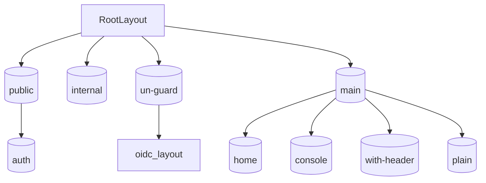

# Layout tree and route groups

Parentheses segments `(name)` are **route groups**: they **do not** appear in the URL. Layouts nest from root downward.

## Diagram

## Segment reference

| Segment | Layout file | Chrome / behavior |
|---------|-------------|-------------------|
| Root | `src/app/layout.tsx` | Theme, React Query, toasts, chat embed; optional server `redirect` for `internalRoutes` |
| `(public)` | `src/app/(public)/layout.tsx` | `Suspense`, `PublicGuard` |
| `(public)/(auth)` | `src/app/(public)/(auth)/layout.tsx` | Logo, two-column layout, IDP `BlockInfo` |
| `(internal)` | `src/app/(internal)/layout.tsx` | `PublicGuard` only |
| `(un-guard)/oidc` | `src/app/(un-guard)/oidc/layout.tsx` | `OIDCProvider`, branded OIDC shell |
| `(main)` | `src/app/(main)/layout.tsx` | `ProtectedGuard`, studio view-mode reset |
| `(main)/(home)` | `src/app/(main)/(home)/layout.tsx` | `ProjectGaurd`, sidebar, dashboard header, i18n, page sidebar |
| `(main)/(console)` | `src/app/(main)/(console)/layout.tsx` | Console header |
| `(main)/(with-header)` | `src/app/(main)/(with-header)/layout.tsx` | Dashboard header strip (no full home sidebar stack) |
| `(main)/(plain)` | per-feature (e.g. `new-communication/layout.tsx`) | Minimal feature chrome (e.g. stepper) |
| `(main)/code-studio` | `src/app/(main)/code-studio/layout.tsx` | Code studio shell |

Deeper routes may add their own `layout.tsx` (storage, AI details, etc.).

## Example URLs

| URL | Layout chain (conceptual) |
|-----|---------------------------|
| `/login` | Root → `(public)` → `(auth)` |
| `/services/iam` | Root → `(main)` → `(home)` |
| `/profile` | Root → `(main)` → `(console)` |
| `/oidc/login` | Root → `(un-guard)` → `oidc` |
| `/mfa-check` | Root → `(internal)` |
| `/activate` | Root → `(public)` (no `(auth)` wrapper unless nested) |

Confirm exact nesting by opening the matching folder under `src/app/`.
